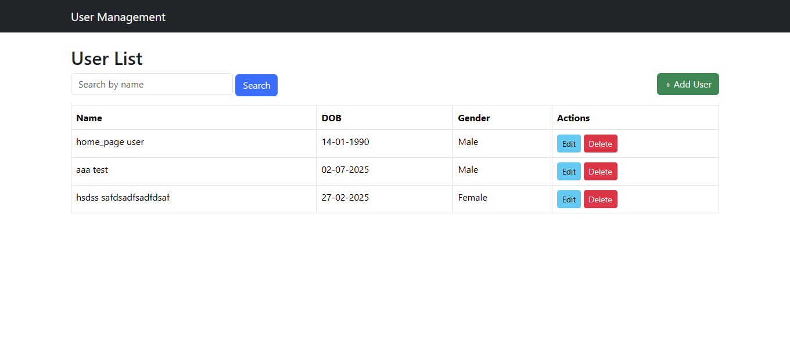
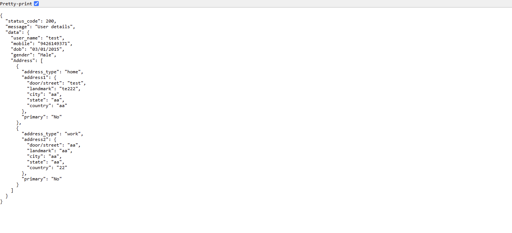

# 🧑‍💼 Laravel Practicle User Management System

A complete User Management System built with Laravel 12.x and Blade template:

- ✅ Creating, Updating, and Deleting Users
- 🔍 Search by First Name
- 📄 Pagination
- 📬 Client-side + Server-side Validation
- 🌍 Multi-address support (Home/Work)
- 🔥 Blade template messages (Success/Error)
- 🧪 Unit Tests
- 📡 API endpoint to fetch user details

---

## 🚀 Technologies Used

- Laravel 12.20.0
- MySQL 
- Blade template
- PHPUnit

---
## 📸 Screenshots

### 🧾 User List Page


### ➕ Create User Form


### ✏️ Edit User Page


### ✅ API Responce


## 📦 Installation

```bash
git clone https://github.com/nparekh165/practicle-user-management.git
cd practicle-user-management

# Install backend dependencies
composer install

# Open New Terminal  & Setup .env
cp .env.example .env
php artisan key:generate

# Setup database
php artisan migrate

# Seed some test data (optional)
php artisan db:seed

# Run Laravel using artisan command 
php artisan serve

# To Run Unit test
php artisan test tests/Feature/UserManagementTest.php

## 📡 API: Get User Details

### Endpoint:
`GET /api/users/{user_id}`

### ✅ Success Response:

```json
{
  "status_code": 200,
  "message": "User details",
  "data": {
    "user_name": "aaa",
    "mobile": "343434343",
    "dob": "02/07/2025",
    "gender": "Male",
    "Address": [
      {
        "address_type": "work",
        "address1": {
          "door/street": null,
          "landmark": null,
          "city": "aaa",
          "state": "aa",
          "country": "aa"
        },
        "primary": "No"
      }
    ]
  }
}
### ❌ Error Response (User Not Found)

```json
{
  "status_code": 404,
  "message": "User not found",
  "data": []
}
